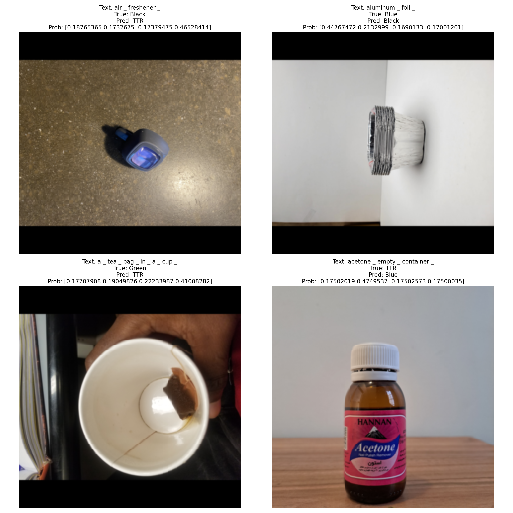
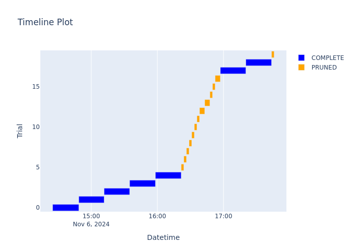
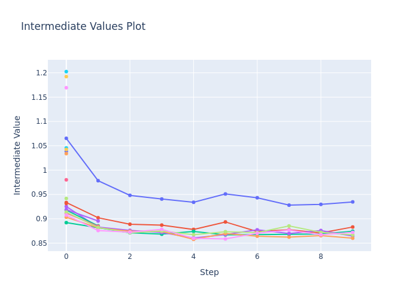
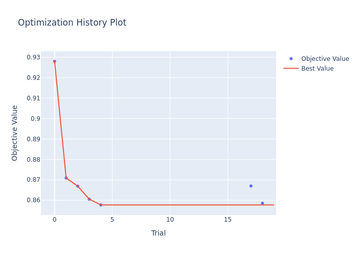
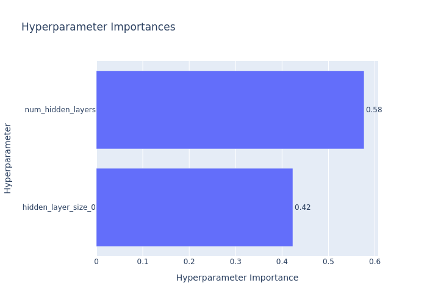

# Assignment 2 for ENEL 645 Garbage classification system

## Armin Ghayur Sadigh - Ranuki Hettiarachchige

---

### Introduction

The goal of this project is to develop a system that can categorize garbage using an image and a short description of it.

### Methodology

#### Model choice

We adapted a combination of ResNet101 and BERT to process images and text descriptions, respectively.

- ResNet101 used the **IMAGENET1K_V2** pre-trained weights. This model has shown 81.89% acc@1 using the ImageNet-1K dataset, making it a better performing alternative compared to ResNet models with less layers.
- The BERT model used for this project is the **bert-base-uncased** pre-trained model.

#### Training approach

We adapted a hyperparameter optimization process to optimize the number of additional hidden layers and the node count in each layer. This task was done using the **Optuna** python framework. To ensure that unpromising trials of new hyperparameters are stopped early and do not take time and computation power, a pruner was implemented to introduce an early stopping method for trials with poor performance and improvement over time.

For additional improvements, a learning rate optimizer was used so that the learning rate would be reduced in case a plateau occurs in training.

The goal of the optimization and our metric for selecting the best model is having minimum loss value for the validation dataset.

#### Hardware

Processing was done on a v-100 GPU machine from the university's ARC cluster.

### Results

#### Predictive performance

The loss function chosen for this task is the **Cross Entrophy loss function**. Our performance assessment metrics are: **Accuracy**, **AUC**, and **F1 score**. Additionally, we analyze the **confusion matrix**.

| Dataset    | Loss   | Accuracy | AUC    | F1 Score |
| ---------- | ------ | -------- | ------ | -------- |
| Training   | 0.7577 | 0.9874   | 0.9926 | 0.9873   |
| Validation | 0.8601 | 0.8811   | 0.9597 | 0.8812   |
| Testing    | 0.9065 | 0.8312   | 0.9411 | 0.8301   |

The confusion matrices of each dataset can be seen below:

| _Training_ | Black | Blue | Green | TTR  |
| ---------- | ----- | ---- | ----- | ---- |
| **Black**  | 2084  | 21   | 2     | 4    |
| **Blue**   | 7     | 4331 | 10    | 7    |
| **Green**  | 4     | 43   | 1941  | 3    |
| **TTR**    | 7     | 19   | 2     | 1715 |

| _Validation_ | Black | Blue | Green | TTR |
| ------------ | ----- | ---- | ----- | --- |
| **Black**    | 313   | 38   | 7     | 14  |
| **Blue**     | 37    | 701  | 20    | 10  |
| **Green**    | 11    | 31   | 306   | 4   |
| **TTR**      | 21    | 17   | 4     | 266 |

| _Testing_ | Black | Blue | Green | TTR |
| --------- | ----- | ---- | ----- | --- |
| **Black** | 500   | 111  | 18    | 66  |
| **Blue**  | 45    | 991  | 29    | 20  |
| **Green** | 28    | 43   | 720   | 8   |
| **TTR**   | 81    | 115  | 15    | 641 |

Below you can see 4 misclassified samples. Their descriptive text, true label, predicted label, and probabilities of belonging to each class (Black, Blue, Green, TTR) can be seen above them.

#### Hyperparameter optimization

The final result of the optimization process concluded that best validation loss value can be achieved using 1 hidden layer comprised of 512 neurons.

The timeline of the optimization process and its 20 trials can be seen below. Trials that had poor performance from the beginning, or showed slow improvements compared to previous trials were pruned (early stopping).

The progress of each trial through 10 epochs and their loss values can be seen in the figure below. Trials that got pruned have a shorter history of objective value.

The progress of this study in improving the objective value (loss value) can be seen in the figure below.

Additional analysis on the impact of changing the hyperparameters on the loss value shows that the most important hyperparameter is the number of additional hidden layers used.

### Additional information

The output log of the code can be found in the files provided in the **outputs** folder.
